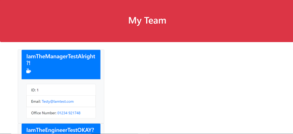

# Team-Profile-Generator
A command-line application that takes in information about employees on a software engineering team, then generates an HTML webpage that displays summaries for each person. It also contains tests to make sure the application works.

## Contents
Section | Description
------------ | -------------
[Deployment](#Walk-Through) | Link to Video Walk-Through
[Technologies](#Technologies) | Technologies Used
[Installation](#Installation) | Installation Information
[Usage](#Usage) | How to use the application
[Screenshots](#Screenshots) | Screenshots of the deployed application
[Licence](#licence) | Licence for the source code
[Questions](#Questions?) | Where you can reach me

## Walk-Through
Launch the video ---> [here](https://drive.google.com/file/d/14jbpXlXFb-bP9ghZziJ0cVHlLSJuDAqm/view)

## Technologies Used

- JavaScript
- SQL

## Installation
 To run this application locally, do the following:
 - (i) Clone this repository from GitHub
- (ii) This app contains a package.json so you just need to run `npm i` from the root directory to install the relative node packages
- (iii) run `npm start` in the terminal from the root directory 

## Usage
* Follow the installation instructions above to run the app on your local device.
* a video  walkthrough can be found at the top of the README as well

## Screenshots
App in action --->

## License

> This project was created under the standard MIT licence.

> [Learn more about this licence.](https://lbesson.mit-license.org/)

## Questions?

Please contact me through my GitHub provided below if you have any questions relating to how the application works or any of my other projects

My GitHub username is Robbie-Bridgwater

Link to my GitHub Profile ---> https://github.com/Robbie-Bridgwater
